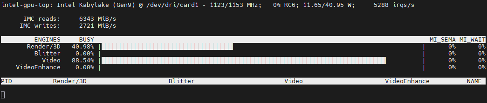
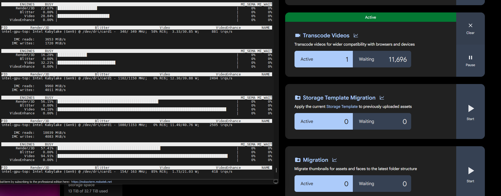

# Intel iGPU Passthrough for Immich on HPE VM Essentials (KVM/GVT-g)

> **Status:** Working ✅  
> **Platform:** HPE VM Essentials (VME) — KVM/libvirt  


---

## Background & Motivation

HPE VM Essentials does not yet offer a native GPU passthrough feature in its management UI. This guide documents how to enable **Intel GVT-g mediated device passthrough** at the KVM level to pass an Intel iGPU into a dedicated Immich VM for hardware-accelerated video transcoding via VAAPI.

This work was done as part of a full migration from **Proxmox VE to HPE VM Essentials**, managed via a **Morpheus Data** appliance. The goal was to replicate the GPU-accelerated Immich transcoding that was previously running on Proxmox without waiting for HPE to ship a native solution.

**Why a dedicated host?**  
The Immich VM (`photos`) runs on its own dedicated physical host (`vme4`) — an Intel Core i7-7700 system chosen specifically for its Kaby Lake iGPU (Intel HD Graphics 630, Gen9) and strong CPU transcoding headroom. This gives Immich exclusive access to the GPU and avoids contention with other VMs.

---

## Hardware

| Component | Details |
|-----------|---------|
| **Host** | HPE VM Essentials host (`vme4`) |
| **CPU** | Intel Core i7-7700 @ 3.60GHz (Kaby Lake, 4C/8T) |
| **iGPU** | Intel HD Graphics 630 (Gen9, PCI 00:02.0) |
| **Passthrough method** | Intel GVT-g (mediated device / mdev) |
| **Guest VM** | `photos` — Ubuntu 24.04 LTS |
| **Application** | Immich (Docker) |
| **Acceleration** | VAAPI hardware transcoding |

### Why Intel GVT-g instead of full PCIe passthrough?

Kaby Lake iGPUs can support full PCIe passthrough via VFIO when VT-d is enabled in BIOS and intel_iommu=on is set — sometimes also requiring x-igd-opregion=on for display output. However, on this specific board the firmware DMAR table explicitly disables IOMMU for the iGPU:
```
DMAR: Disabling IOMMU for graphics on this chipset
```
This is an OEM/board-level firmware decision, not a universal Kaby Lake silicon limitation. On this hardware, full PCIe passthrough is not possible regardless of software configuration. GVT-g (mediated device passthrough) is the correct path — it creates a virtual GPU slice presented to the guest with no IOMMU requirement.
If your board does not have this DMAR restriction (i.e., VT-d works for your iGPU), full PCIe passthrough with VFIO may be an option and will give the guest exclusive GPU access. GVT-g remains useful even then since it allows sharing the iGPU across multiple VMs simultaneously.

### Why not OpenVINO for ML acceleration?

Kaby Lake (Gen9) is not supported by the current Intel OpenVINO runtime for Immich's CLIP/face detection workloads. CPU inference on the i7-7700 is more than capable for Immich ML tasks at this scale.

---

## Proof — VAAPI Hardware Transcoding Active




`intel-gpu-top` on the VME host (`vme4`) showing the HD 630 Video engine at **88.54% utilization** and Render/3D at **40.98%** while Immich transcodes video through the GVT-g vGPU at 1123MHz.

---

## Prerequisites

- HPE VM Essentials host running Ubuntu 24.04 LTS
- Intel CPU with iGPU, Kaby Lake (Gen9) or newer (GVT-g supported up to Ice Lake)
- VT-x enabled in BIOS (VT-d/IOMMU not required for GVT-g)
- Immich running in Docker on an Ubuntu 24.04 guest VM
- `libvirt` / `virsh` available on the host (standard with VME)

---

## Step-by-Step Process

### Step 1 — Verify the iGPU PCI address

```bash
lspci | grep -i "VGA\|Display\|HD Graphics"
# Expected output: 00:02.0 VGA compatible controller: Intel Corporation HD Graphics 630
```

### Step 2 — Install VAAPI driver on the host

HPE VME ships a minimal Ubuntu with no standard Ubuntu repos. Add the Ubuntu universe repo temporarily to install required packages, then remove it to preserve HPE support.

```bash
# Add Ubuntu noble repos temporarily
echo "deb http://archive.ubuntu.com/ubuntu noble main restricted universe multiverse" | \
  sudo tee /etc/apt/sources.list.d/ubuntu-noble.list
echo "deb http://archive.ubuntu.com/ubuntu noble-updates main restricted universe multiverse" | \
  sudo tee -a /etc/apt/sources.list.d/ubuntu-noble.list

sudo apt update
sudo apt install -y vainfo intel-media-va-driver

# Remove the repo immediately — keeps HPE support intact
sudo rm /etc/apt/sources.list.d/ubuntu-noble.list
sudo apt update
```

> **Important:** Installed packages persist after the repo is removed. HPE's update system only manages packages from its own repos. The VAAPI driver will survive HPE platform updates.

Verify VAAPI is working on the host:
```bash
sudo vainfo --display drm --device /dev/dri/renderD128
# Should show VAProfileH264, VAProfileHEVC entries
```

### Step 3 — Enable GVT-g in GRUB

```bash
sudo nano /etc/default/grub
```

Edit `GRUB_CMDLINE_LINUX` to include `i915.enable_gvt=1`:
```
GRUB_CMDLINE_LINUX="iommu=pt intel_iommu=on i915.enable_gvt=1 workqueue.power_efficient=0 intel_idle.max_cstate=0 processor.max_cstate=1"
```

> **Note:** The HPE VME platform pre-sets `iommu=pt intel_iommu=on` in this line. Do not remove those — only add `i915.enable_gvt=1`.

### Step 4 — Load kvmgt module at boot

```bash
echo "kvmgt" | sudo tee /etc/modules-load.d/kvmgt.conf
```

### Step 5 — Update GRUB and reboot the host

```bash
sudo update-grub
sudo reboot
```

### Step 6 — Verify GVT-g is active

After reboot:
```bash
# Confirm i915 GVT-g parameter is active
sudo cat /sys/module/i915/parameters/enable_gvt
# Expected: Y

# Confirm kvmgt loaded
lsmod | grep kvmgt

# Confirm mdev types are available
ls /sys/bus/pci/devices/0000:00:02.0/mdev_supported_types/
# Expected: i915-GVTg_V5_4  i915-GVTg_V5_8
```

### Step 7 — Create the vGPU mdev instance

Two vGPU types are available:
- `i915-GVTg_V5_4` — up to 4 instances, ~128MB aperture per vGPU (**recommended for single-VM use**)
- `i915-GVTg_V5_8` — up to 8 instances, ~64MB aperture per vGPU

```bash
# Generate a UUID — save this, you'll need it throughout
UUID=$(uuidgen)
echo "vGPU UUID: $UUID"

# Create the vGPU instance
echo $UUID | sudo tee /sys/bus/pci/devices/0000:00:02.0/mdev_supported_types/i915-GVTg_V5_4/create

# Verify creation
sudo ls /sys/bus/mdev/devices/
```

### Step 8 — Make the vGPU persistent across host reboots

```bash
sudo tee /etc/systemd/system/gvt-g-vgpu.service << EOF
[Unit]
Description=Create Intel GVT-g vGPU for Immich
After=systemd-modules-load.service
Before=libvirtd.service

[Service]
Type=oneshot
RemainAfterExit=yes
ExecStart=/bin/bash -c 'echo ${UUID} > /sys/bus/pci/devices/0000:00:02.0/mdev_supported_types/i915-GVTg_V5_4/create'

[Install]
WantedBy=multi-user.target
EOF

sudo systemctl enable gvt-g-vgpu.service
```

### Step 9 — Add the vGPU to the Immich VM (libvirt XML)

```bash
sudo virsh edit photos
```

Add the following block inside the `<devices>` section, using the UUID from Step 7:

```xml
<hostdev mode='subsystem' type='mdev' managed='no' model='vfio-pci' display='off'>
  <source>
    <address uuid='YOUR-UUID-HERE'/>
  </source>
</hostdev>
```

Start (or restart) the VM:
```bash
sudo virsh start photos
```

### Step 10 — Verify the iGPU is visible inside the VM

SSH into the Immich VM and run:
```bash
lspci | grep -i vga
# Should show BOTH a virtual VGA (1234:1111) AND Intel HD Graphics 630

ls /dev/dri/
# Should show card0, card1, renderD128
```

### Step 11 — Configure Immich Docker Compose

Add the render and video groups to `immich-server` in `docker-compose.yml`:

```yaml
services:
  immich-server:
    # ... existing config ...
    group_add:
      - "993"   # render group GID — verify with: stat -c "%g" /dev/dri/renderD128
      - "44"    # video group GID  — verify with: getent group video
```

> **Note:** Use numeric GIDs rather than group names for compatibility inside the container. Verify the actual GIDs on your system before applying.

Fix the inotify watcher limit (required for large photo libraries):
```bash
echo "fs.inotify.max_user_watches=524288" | sudo tee -a /etc/sysctl.conf
sudo sysctl -p
```

Restart Immich:
```bash
cd ~/immich-app
sudo docker compose down && sudo docker compose up -d
```

Verify `/dev/dri` is visible inside the container:
```bash
sudo docker exec immich_server ls -la /dev/dri/
```

### Step 12 — Enable VAAPI in the Immich Admin UI

1. Navigate to your Immich instance
2. **Administration → Video Transcoding Settings**
3. **Hardware Acceleration** → select **VAAPI**
4. Save

### Step 13 — Verify transcoding is using the GPU

On the VME host, while a video is being transcoded in Immich:
```bash
sudo intel_gpu_top
```

You should see the **Video** engine showing significant utilization (10–90%+ depending on workload).

---

## Troubleshooting

**`i915.enable_gvt=1` not taking effect after reboot**  
Check `cat /proc/cmdline` to verify the parameter is actually in the boot command line. A typo (e.g., `wi915.enable_gvt=1`) will silently fail. Verify with `sudo cat /sys/module/i915/parameters/enable_gvt` — should return `Y`.

**`mdev_supported_types` directory does not exist**  
GVT-g did not initialize. Check `sudo dmesg | grep -i gvt` for errors. Confirm kvmgt module is loaded: `lsmod | grep kvmgt`.

**`/dev/dri/renderD128` not visible inside VM**  
The `<hostdev>` XML block may not have been saved correctly. Run `sudo virsh dumpxml photos | grep -A5 hostdev` to verify. Also ensure the VM was fully stopped and restarted (not just rebooted from inside).

**VAAPI device permission denied in Immich container**  
Verify the GIDs in `group_add` match what `stat -c "%g" /dev/dri/renderD128` returns on the guest VM. GIDs can differ between host and guest.

**File watcher errors in Immich logs (`ENOSPC`)**  
Increase inotify watchers: `echo "fs.inotify.max_user_watches=524288" | sudo tee -a /etc/sysctl.conf && sudo sysctl -p`

---

## Important Notes for HPE VM Essentials Platform

- **Repo hygiene:** Always remove temporary Ubuntu repos after package installation. 
- **GRUB_CMDLINE_LINUX vs GRUB_CMDLINE_LINUX_DEFAULT:** On VME hosts, GPU and CPU power parameters live in `GRUB_CMDLINE_LINUX`, not `GRUB_CMDLINE_LINUX_DEFAULT`. Add `i915.enable_gvt=1` to the correct variable.
- **VT-d not required:** GVT-g does not need VT-d/IOMMU. Intel explicitly disables IOMMU for the iGPU on Kaby Lake anyway. VT-x is sufficient.
- **VME GPU feature:** As of this writing, HPE VM Essentials does not expose GPU passthrough through the Morpheus/VME UI. This process is performed directly via `virsh` on the KVM host. When HPE ships native GPU support, this manual XML approach may be superseded.

---

*Built as part of a full homelab migration from Proxmox VE to HPE VM Essentials + Morpheus Data.*
